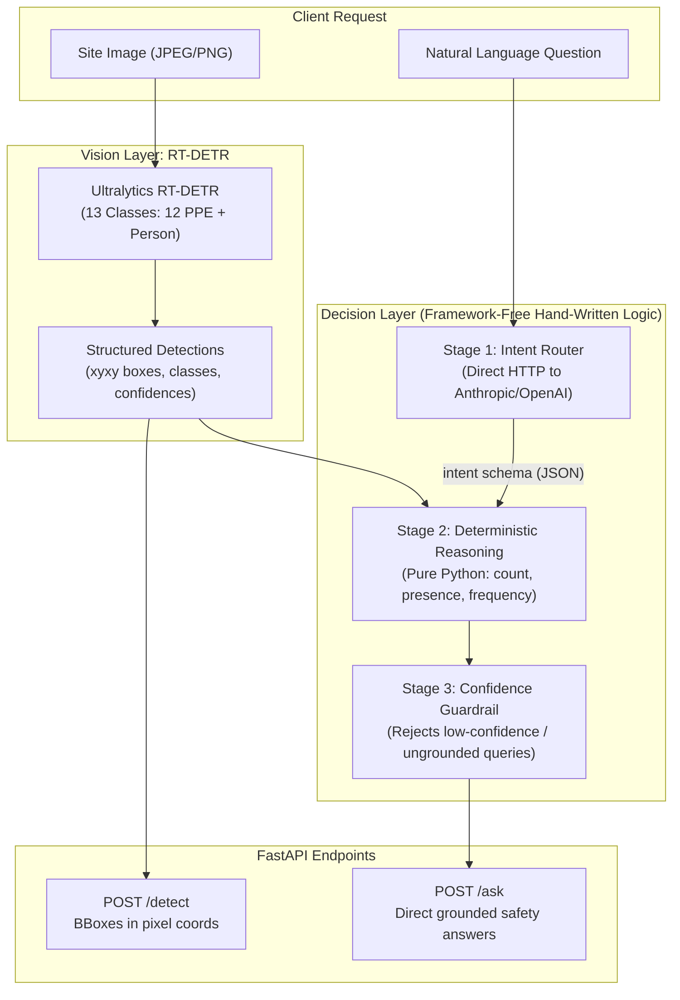

# RT-DETR-Based Object Detection for Safety Equipment

[](https://fastapi.tiangolo.com)
[](https://docs.ultralytics.com/models/rtdetr/)
[](https://www.python.org/)
[](https://github.com/astral-sh/uv)

A production-ready computer vision and multi-modal query API for construction site Personal Protective Equipment (PPE) compliance detection. Built with **Ultralytics RT-DETR** (Real-Time Detection Transformer) and a **hand-written, framework-free 3-stage reasoning decision layer**.

---

## 🏗️ System Architecture



---

## 📂 Repository Structure

```
rtdetr-ppe/
├── README.md                      # Setup instructions, architecture, and curl examples
├── TRAINING.md                    # Exact reproducibility log (hardware, time, hyperparams, seed)
├── requirements.txt               # Pinned dependencies
├── pyproject.toml                 # uv project configuration
├── Dockerfile                     # Container deployment spec
├── data.yaml                      # 13-class dataset configuration
├── data/
│   ├── prepare_split.py           # Split validation, class distribution analysis, and integrity check
│   └── README.md                  # Dataset sourcing & structure instructions
├── add_person_class.py            # Person class auto-labeling script (COCO YOLO11 anchor)
├── fix_mixed_labels.py            # Label sanitizer for Roboflow export artifacts
├── train.py                       # Local CPU smoke test + fine-tuning script
├── kaggle_train.py                # Drop-in cloud training script for Kaggle/Colab T4
├── evaluate.py                    # Evaluation script: mAP50, mAP50-95, P/R, and critical pair confusion
├── app/
│   ├── __init__.py
│   ├── main.py                    # FastAPI application (/detect and /ask endpoints)
│   ├── detection.py              # RT-DETR inference engine (bounding boxes in xyxy pixel coords)
│   └── reasoning.py              # Hand-written 3-stage decision layer
└── weights/
    ├── .gitkeep
    └── README.md                  # Checkpoint storage instructions (best.pt)
```

---

## 🏷️ Dataset Classes (13 Classes)

The model detects 12 non-COCO safety compliance classes plus the `Person` COCO anchor class:

| ID | Class Name | Category | Description |
|:---|:---|:---|:---|
| 0 | `Eye_protection` | Compliant | Safety glasses / goggles |
| 1 | `Foot_protection` | Compliant | Steel-toe boots / safety footwear |
| 2 | `Hand_protection` | Compliant | Protective gloves |
| 3 | `Head_protection` | Compliant | Hardhat / helmet |
| 4 | `No_eye_protection` | **Violation** | Exposed eyes without protection |
| 5 | `No_foot_protection` | **Violation** | Inadequate footwear |
| 6 | `No_hand_protection` | **Violation** | Bare hands |
| 7 | `No_head_protection` | **Violation** | Bare head without hardhat |
| 8 | `No_respiratory_protection` | **Violation** | Unprotected respiratory zone |
| 9 | `No_safety_vest` | **Violation** | Worker without high-vis vest |
| 10 | `Respiratory_protection` | Compliant | Face mask / respirator |
| 11 | `Safety_vest` | Compliant | High-visibility safety vest |
| 12 | `Person` | Anchor / Context | Full person body bounding box |

---

## 🚀 Quickstart

### 1. Installation

This project is managed using [`uv`](https://github.com/astral-sh/uv) for fast, reproducible dependency resolution:

```bash
# Clone the repository
git clone https://github.com/syedraihanm/rtdetr-ppe.git
cd rtdetr-ppe

# Sync environment using uv
uv sync
```

Alternatively with standard `pip`:
```bash
python -m venv .venv
source .venv/bin/activate  # On Windows: .venv\Scripts\activate
pip install -r requirements.txt
```

### 2. Download Model Weights

The fine-tuned `best.pt` checkpoint (~246 MB, Epoch 65, **79.19% mAP@50**) is hosted on GitHub Releases:

```bash
# Linux / macOS / Git Bash
curl -L https://github.com/syedraihanm/rtdetr-ppe/releases/download/v1.0/best.pt -o weights/best.pt

# Windows PowerShell
Invoke-WebRequest -Uri https://github.com/syedraihanm/rtdetr-ppe/releases/download/v1.0/best.pt -OutFile weights/best.pt
```

> **Direct link:** https://github.com/syedraihanm/rtdetr-ppe/releases/download/v1.0/best.pt

### 3. Configure Environment Variables (Optional)
To enable the LLM Intent Router for `/ask`, set an API key (if none is set, the service automatically falls back to an intelligent deterministic rule-based router):

```bash
# Optional: Anthropic or OpenAI API key
export ANTHROPIC_API_KEY="your-anthropic-key"
# or
export OPENAI_API_KEY="your-openai-key"

# Optional: Custom model checkpoint path (defaults to weights/best.pt or rtdetr-l.pt)
export MODEL_PATH="weights/best.pt"
```

### 4. Launch API Server

```bash
uv run uvicorn app.main:app --host 0.0.0.0 --port 8000 --reload
```

Interactive Swagger documentation is available at: [http://localhost:8000/docs](http://localhost:8000/docs)

---

## 📡 API Usage & cURL Examples

### Endpoint 1: `/detect` (Object Detection)

Accepts a multipart image upload and returns detected bounding boxes in **pixel coordinates (`[x1, y1, x2, y2]`)**:

```bash
curl -X POST "http://localhost:8000/detect?conf=0.25" \
  -H "accept: application/json" \
  -H "Content-Type: multipart/form-data" \
  -F "file=@sample_site.jpg"
```

**Response (`200 OK`):**
```json
{
  "detections": [
    {
      "class": "Head_protection",
      "confidence": 0.9234,
      "box": [312.45, 84.12, 420.89, 195.67]
    },
    {
      "class": "No_safety_vest",
      "confidence": 0.8415,
      "box": [298.11, 190.54, 450.32, 480.21]
    },
    {
      "class": "Person",
      "confidence": 0.9542,
      "box": [280.15, 80.02, 465.78, 690.45]
    }
  ],
  "image_width": 1280,
  "image_height": 720
}
```

---

### Endpoint 2: `/ask` (Grounded Safety Reasoning)

Answers natural language questions through a strict 3-stage decision layer (**no agent frameworks**):

```bash
curl -X POST "http://localhost:8000/ask" \
  -H "accept: application/json" \
  -H "Content-Type: multipart/form-data" \
  -F "file=@sample_site.jpg" \
  -F "question=Is anyone not wearing a helmet?"
```

**Response (`200 OK`):**
```json
{
  "answer": "Yes, 1 missing head protection violation detected.",
  "used_detection": true,
  "confidence": "high",
  "supporting_detections": [
    {
      "class": "No_head_protection",
      "confidence": 0.8712,
      "box": [510.22, 110.45, 595.34, 215.89]
    }
  ]
}
```

**Confidence Guardrail Example (Insufficient Information):**
```json
{
  "answer": "I can't confidently answer this from the detections — confidence too low.",
  "used_detection": true,
  "confidence": "low",
  "supporting_detections": []
}
```

---

## 🧠 Decision Layer Design (No Frameworks)

`/ask` uses an explicit 3-stage hand-written pipeline:

1. **Stage 1 — Intent Router (`route_intent`)**:
   Makes a direct raw HTTP call (`httpx`) to the LLM API with strict JSON constraint:
   ```json
   {"needs_detection": true, "query_type": "presence_check", "target_class": "Head_protection", "negated": true}
   ```
2. **Stage 2 — Structured Reasoning (`reason_over_detections`)**:
   Pure Python deterministic reasoning over detection coordinates and class outputs (`count`, `presence_check`, `most_common`).
3. **Stage 3 — Confidence Guardrail (`apply_guardrail`)**:
   Validates detection confidence against safety thresholds and flags ungrounded queries when evidence is insufficient.

---

## 🏋️ Training & Reproducibility

### Local CPU Smoke Test
Before committing cloud GPU hours, verify the pipeline locally (runs 10 images on CPU):
```bash
uv run python train.py --smoke-test
```
Every run automatically records environment, hyperparameter configs, and timings in [`TRAINING.md`](TRAINING.md).

### Cloud GPU Fine-Tuning (Kaggle / Colab)
Run full fine-tuning on a free T4 GPU using [`kaggle_train.py`](kaggle_train.py):
```bash
python kaggle_train.py --epochs 100 --batch 16 --model rtdetr-l.pt
```

### Dataset Split Verification
Verify dataset balance and bounding box integrity:
```bash
uv run python data/prepare_split.py --check-integrity
```

---

## 📊 Evaluation

Evaluate fine-tuned checkpoints on the test split and generate confusion matrices for critical safety pairs:

```bash
uv run python evaluate.py --weights weights/best.pt --split test
```

This generates per-class mAP50, mAP50-95, precision/recall metrics, and evaluates critical compliance pairs:
- `Head_protection` vs `No_head_protection`
- `Safety_vest` vs `No_safety_vest`

---

## 🐳 Docker Deployment

Build and run the containerized FastAPI service:

```bash
# Build image
docker build -t rtdetr-ppe:latest .

# Run container
docker run -d -p 8000:8000 --name ppe-api rtdetr-ppe:latest

# Check health
curl http://localhost:8000/health
```

---

## 📄 License
This project is licensed under the [Apache 2.0 License](LICENSE).
The dataset is licensed under [CC BY 4.0](https://universe.roboflow.com/fahim-shahriar-2frao/construction-site-safety-v5wfl/dataset/2).
