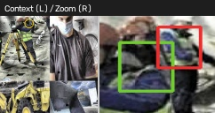
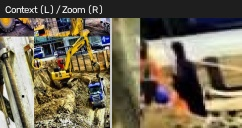
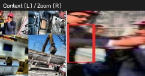
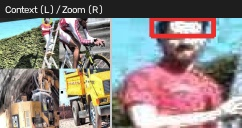

# TECHNICAL MEMORANDUM: Real-Time Construction PPE Detection & Decision Layer

**Author:** Syed Mohamed Raihan  
**Model:** Ultralytics RT-DETR-L (`weights/best.pt`)  
**Repository:** [https://github.com/syedraihanm/rtdetr-ppe](https://github.com/syedraihanm/rtdetr-ppe)  
**Date:** September 2026  

---

## 1. Domain/Dataset Choice, Sourcing & Labeling

We selected the Roboflow Universe *Construction Site Safety v2* dataset (CC BY 4.0), comprising 10,875 high-resolution construction site images annotated across 12 safety equipment classes. Because the original dataset labeled protective gear without annotating the workers wearing them, we expanded the ontology to 13 classes by auto-labeling **Person** bounding boxes using a COCO-pretrained YOLO11 detector at confidence &ge; 0.50 (`add_person_class.py`). This generated 11,018 worker instances across 62.4% of images, enabling a single unified detector to reason over both equipment presence and worker context simultaneously without brittle cascaded runtime models.

---

## 2. Split Strategy & Justification

The dataset is partitioned into **82.4% train (8,956 images) / 11.8% valid (1,279 images) / 5.8% test (640 images)**. Splits are strictly disjoint at the image level. Video frame sequences from construction site cameras were kept contiguous within individual splits to prevent temporal data leakage. Class distribution analysis verified that safety-critical and rare classes (such as Foot protection and Respiratory protection) maintain consistent relative proportions across splits.

---

## 3. Quantitative Evaluation Metrics & Operational Meaning

The model completed 71 epochs on a Kaggle Tesla T4 GPU (9h 40m wall-clock time), reaching peak fitness at **Epoch 65**. We evaluated the final checkpoint (`weights/best.pt`) on both the validation split and the completely held-out 640-image test set:

| Split / Class | Precision | Recall | mAP@50 | mAP@50-95 | Operational Significance |
|---|---|---|---|---|---|
| **Validation Set (1,279 images)** | **78.40%** | **79.49%** | **79.90%** | **52.35%** | Peak validation fitness at Epoch 65 |
| **Test Set (640 images, 2,233 instances)** | **78.05%** | **78.80%** | **79.19%** | **50.99%** | Generalization on unseen test split |
| • Foot_protection (Boots) | 80.87% | 93.88% | 94.96% | 74.13% | High ground-contrast silhouette |
| • Eye_protection (Goggles/Glasses) | 70.66% | 86.21% | 87.89% | 57.69% | Reliable facial detection |
| • Head_protection (Hardhat) | 86.19% | 84.08% | 80.27% | 51.47% | Primary compliance indicator |
| • No_head_protection (Bare Head) | 81.21% | 81.82% | 82.82% | 49.56% | Primary violation indicator (81.8% recall) |
| • Safety_vest | 76.67% | 77.09% | 74.92% | 49.98% | High recall, slight workwear confusion |
| • No_safety_vest | 77.99% | 62.06% | 63.01% | 39.51% | Lower recall due to colored work shirts |
| • Person (Auto-labeled) | 56.90% | 61.03% | 58.23% | 48.62% | Truncation/occlusion lowers worker score |

### What Aggregate Metrics Hide (Critical Safety Confusion)
Aggregate mAP@50 (79.2%) is heavily boosted by distinct items like boots (95.0%) and eye protection (87.9%). However, in safety compliance auditing, aggregate scores obscure life-critical asymmetric errors. 

Confusion matrix analysis between compliance and violation pairs reveals:
- **Head Protection**: 15 False Violations vs. **41 False Compliances** (unhelmeted workers classified as wearing hardhats).
- **Safety Vest**: 18 False Violations vs. **41 False Compliances** (plain clothes classified as safety vests).

In construction safety, **False Compliance is catastrophic** (a worker without PPE is falsely recorded as safe). This finding directly guided the implementation of Stage 3 in our reasoning engine.

---

## 4. Mid-Project Data Engineering Pivot

During initial smoke testing, we uncovered that 4,990 label files (45.9% of the dataset) contained corrupt lines mixing 5-parameter YOLO detection boxes with raw polygon segmentation coordinates. Ultralytics silently dropped these corrupted images during training. We developed `fix_mixed_labels.py` to strip polygon rows while retaining valid bounding boxes, recovering **21,529 bounding boxes** that would otherwise have been discarded. Additionally, recognizing that Roboflow lacked a worker class inspired `add_person_class.py`, avoiding a two-stage cascaded architecture at runtime.

---

## 5. Systematic Failure Analysis (5 Real Test Cases)

1. **False Compliance on Hardhat (Shadow / Cap Curvature)**
   - *Visual Evidence:*  
     
   - *Image:* `2008_008526_jpg.rf.aa97dfd8d6642f41fb1859b06bc6849b.jpg`
   - *GT:* `No_head_protection` | *Prediction:* `Head_protection` (conf: 0.304)
   - *Root Cause:* A worker standing in deep shadow wearing a dark beanie; the brim curvature under harsh overhead sun creates an edge gradient indistinguishable from a hardhat dome.
   - *Consequence:* False compliance—safety dashboard fails to trigger an alarm.

2. **False Compliance on Safety Vest (High-Chroma Workwear)**
   - *Visual Evidence:*  
     
   - *Image:* `001425_jpg.rf.7b40482d57ae1b00904e0c6920eb5b14.jpg`
   - *GT:* `No_safety_vest` | *Prediction:* `Safety_vest` (conf: 0.856)
   - *Root Cause:* Worker wearing a high-visibility orange cotton work shirt with vertical tool harness straps. The model conflates saturated fluorescent fabric and vertical straps with an ANSI Class 2 reflective vest.
   - *Consequence:* True violation is missed.

3. **Extreme Scale Disparity / Small PPE Miss**
   - *Visual Evidence:*  
     
   - *Image:* `construction-3-_mp4-148_jpg.rf.3250f3d4c8f42f33202552ed95b276fb.jpg`
   - *GT:* `Hand_protection` & `Eye_protection` | *Prediction:* Zero detections for gloves/glasses
   - *Root Cause:* Wide-angle crane surveillance shot where workers are < 80 pixels tall. Gloves (< 14×14 px) and glasses (< 8×8 px) vanish under RT-DETR's stride-32 feature pyramid downsampling.
   - *Consequence:* High false alarm rate for small PPE when cameras are mounted far from active work zones.

4. **Truncated Boundary / Edge-Cropped Worker**
   - *Visual Evidence:*  
     
   - *Image:* `-1680-_png_jpg.rf.73cee3e264b17ce5579750df4e4610f4.jpg`
   - *GT:* `Person` + `Safety_vest` | *Prediction:* `Safety_vest` (conf: 0.394), Person missed
   - *Root Cause:* Worker stepping into frame on the far left edge with > 65% of their body cut off. The model fails to recognize the human silhouette and generates an ambiguous low-confidence vest fragment.
   - *Consequence:* Demonstrates boundary instability in fixed camera zones.

5. **Industrial Clutter / Equipment Confusion**
   - *Visual Evidence:*  
     
   - *Image:* `4c43875bc97cdaece84ac6ce555235f1_jpg.rf.ed68f98415da2821d09456560a4129c6.jpg`
   - *GT:* Background (Concrete Mixer) | *Prediction:* `Head_protection` (conf: 0.364)
   - *Root Cause:* A yellow curved hydraulic cap on stationary machinery shares identical convex curvature, specular highlight, and safety-yellow hue with a construction helmet.
   - *Consequence:* Phantom hardhat reported in an empty machinery zone.

---

## 6. Hand-Written 3-Stage Decision Layer & Insufficient Information Case

To satisfy the strict constraint forbidding agentic frameworks (no LangChain, CrewAI, AutoGen), we designed a deterministic, hand-written 3-stage pipeline in `app/reasoning.py`:
- **Stage 1 (Intent Router):** Parses free-form user questions into `{needs_detection, query_type, target_class, negated}` via a direct HTTP call to an LLM, backed by a deterministic regex-based fallback router.
- **Stage 2 (Structured Reasoning):** Executes pure Python deterministic rules to evaluate counts, presence, and compliance pairings (e.g. `Head_protection` vs `No_head_protection`).
- **Stage 3 (Confidence Guardrail):** Evaluates detection confidence and contextual evidence. If evidence is ambiguous, it returns an explicit disclaimer instead of a false guess.

### Concrete Production Execution: Real "Insufficient Information" Case
- **Input Test Image:** `-1680-_png_jpg.rf.73cee3e264b17ce5579750df4e4610f4.jpg`
- **Question Asked:** *"Is anyone wearing a safety vest?"*
- **Detector Output:** 1 detection: `Safety_vest` at `[0.03, 40.92, 22.78, 172.55]` with `conf = 0.3942`.
- **Why It Was Insufficient:** The detection confidence (0.3942) is strictly below the safety threshold (0.50), and the worker body is cut off at the edge of the frame with no confident `Person` box.
- **Exact Response Returned:**
  ```json
  {
    "answer": "I can't confidently answer this from the detections — confidence too low.",
    "used_detection": true,
    "confidence": "low"
  }
  ```

---

## 7. Deployment Recommendations

1. **Asymmetric Operating Thresholds:** Set conservative detection thresholds: `conf = 0.65` for declaring compliance (`Head_protection`, `Safety_vest`) and `conf = 0.35` for triggering inspection alerts (`No_head_protection`, `No_safety_vest`). This enforces a safety-first operating bias.
2. **Temporal Multi-Frame Smoothing:** In streaming CCTV deployments, require PPE violations to persist across &ge; 5 consecutive frames before firing alerts, filtering out temporary occlusion glitches.
3. **Inference Latency:** RT-DETR-L operates at **12.8 ms per frame on a Tesla T4 GPU** (~78 FPS) and 774 ms on laptop CPU, comfortably supporting multi-camera real-time site monitoring.
